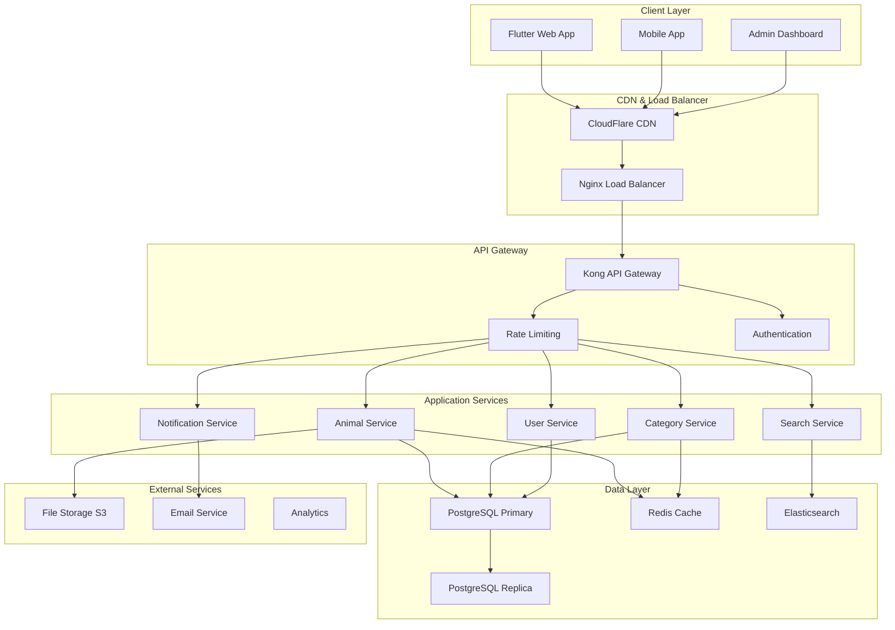
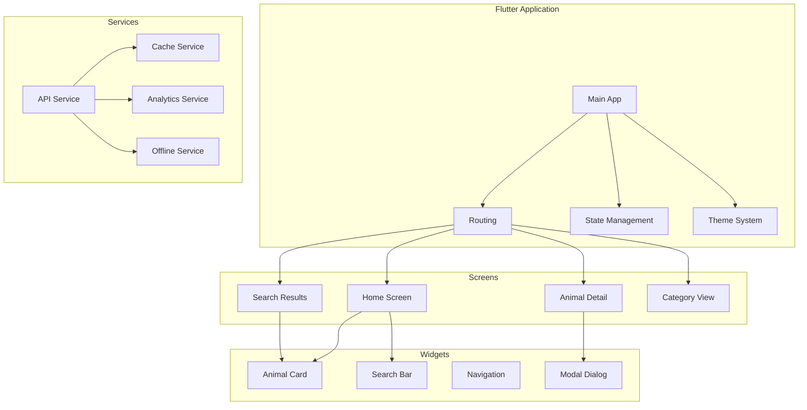
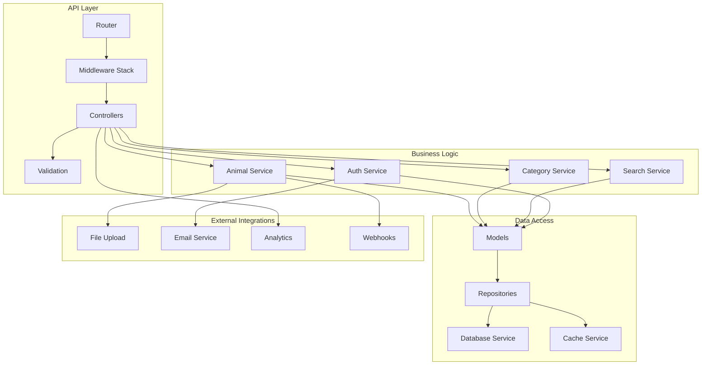
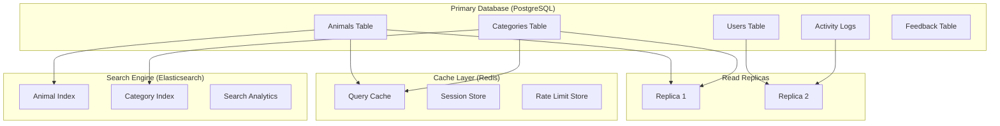
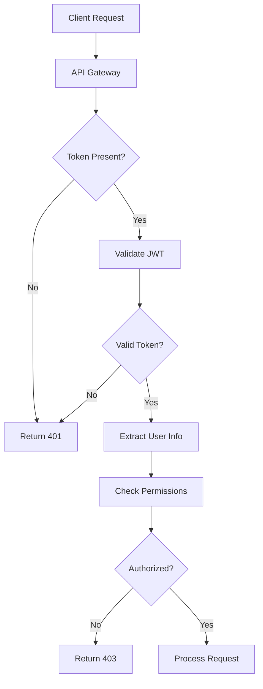
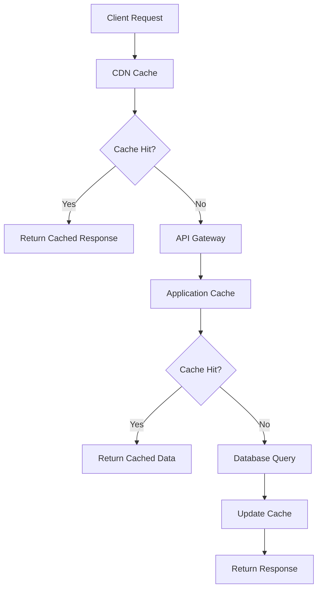
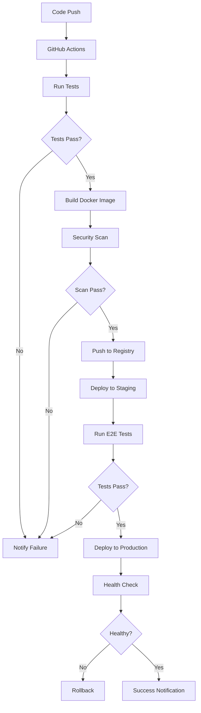
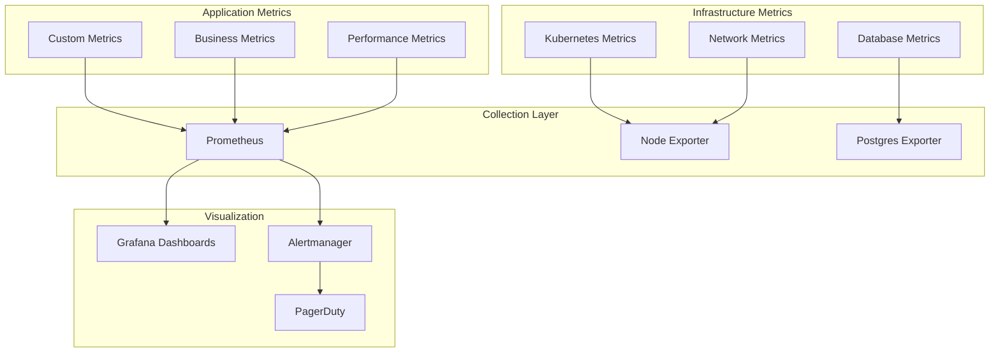

# Vision Week Virtual Exploration - Architecture Documentation

## Overview

Vision Week Virtual Exploration is a modern, scalable web application built with a microservices architecture, containerized deployment, and comprehensive CI/CD pipeline. The application provides an immersive virtual exploration experience for learning about animals and their habitats.

## Architecture Principles

### 1. Scalability
- **Horizontal scaling** with Kubernetes auto-scaling
- **Microservices** architecture for independent scaling
- **Load balancing** across multiple instances
- **Database sharding** for large datasets

### 2. Security
- **Zero-trust** security model
- **End-to-end encryption** for data in transit
- **Multi-layer** authentication and authorization
- **Regular security** audits and penetration testing

### 3. Reliability
- **High availability** with 99.9% uptime target
- **Fault tolerance** with circuit breakers
- **Graceful degradation** during failures
- **Automated recovery** mechanisms

### 4. Performance
- **Sub-second** response times
- **CDN** for global content delivery
- **Caching** at multiple layers
- **Optimized** database queries

## System Architecture



## Technology Stack

### Frontend
- **Flutter 3.24.5** - Cross-platform UI framework
- **Dart** - Programming language
- **Material Design 3** - Design system
- **Responsive Design** - Mobile-first approach

### Backend
- **PHP 8.2** - Server-side language
- **Nginx** - Web server and reverse proxy
- **JWT** - Authentication tokens
- **RESTful API** - API architecture

### Database
- **PostgreSQL 15** - Primary database
- **Redis 7** - Caching and sessions
- **Elasticsearch** - Search engine

### Infrastructure
- **Docker** - Containerization
- **Kubernetes** - Container orchestration
- **Railway** - Cloud deployment platform
- **GitHub Actions** - CI/CD pipeline

### Monitoring & Observability
- **Prometheus** - Metrics collection
- **Grafana** - Visualization and dashboards
- **Sentry** - Error tracking
- **Lighthouse** - Performance monitoring

## Component Architecture

### 1. Frontend Architecture



#### State Management
- **Provider Pattern** for dependency injection
- **ChangeNotifier** for reactive state updates
- **Local Storage** for offline capabilities
- **Cache Management** for performance optimization

#### Responsive Design
- **Breakpoints**: Mobile (< 768px), Tablet (768-1024px), Desktop (> 1024px)
- **Adaptive Layouts** based on screen size
- **Touch-friendly** interactions
- **Accessibility** compliance (WCAG 2.1 AA)

### 2. Backend Architecture



#### Middleware Stack
1. **CORS** - Cross-origin resource sharing
2. **Security Headers** - XSS, CSRF protection
3. **Rate Limiting** - Request throttling
4. **Authentication** - JWT validation
5. **Logging** - Request/response logging
6. **Error Handling** - Centralized error management

#### Service Layer
- **Single Responsibility** - Each service has one purpose
- **Dependency Injection** - Loose coupling
- **Interface Contracts** - Consistent APIs
- **Error Handling** - Graceful failure management

### 3. Database Architecture



#### Database Schema

**Animals Table:**
```sql
CREATE TABLE animals (
    id SERIAL PRIMARY KEY,
    uuid UUID UNIQUE NOT NULL DEFAULT gen_random_uuid(),
    name VARCHAR(255) NOT NULL,
    scientific_name VARCHAR(255) UNIQUE NOT NULL,
    category_id INTEGER REFERENCES categories(id),
    description TEXT,
    habitat VARCHAR(255),
    diet VARCHAR(100),
    conservation_status VARCHAR(100),
    average_lifespan INTEGER,
    weight_range VARCHAR(100),
    height_range VARCHAR(100),
    fun_facts JSONB,
    image_url VARCHAR(500),
    gallery JSONB,
    created_at TIMESTAMP DEFAULT CURRENT_TIMESTAMP,
    updated_at TIMESTAMP DEFAULT CURRENT_TIMESTAMP,
    deleted_at TIMESTAMP NULL
);
```

**Indexes:**
```sql
CREATE INDEX idx_animals_category ON animals(category_id);
CREATE INDEX idx_animals_conservation ON animals(conservation_status);
CREATE INDEX idx_animals_name_search ON animals USING gin(to_tsvector('english', name));
CREATE INDEX idx_animals_scientific_name ON animals(scientific_name);
CREATE UNIQUE INDEX idx_animals_scientific_name_category ON animals(scientific_name, category_id) WHERE deleted_at IS NULL;
```

## Security Architecture

### 1. Authentication & Authorization



#### JWT Token Structure
```json
{
  "header": {
    "alg": "HS256",
    "typ": "JWT"
  },
  "payload": {
    "sub": "user_id",
    "email": "user@example.com",
    "role": "user",
    "permissions": ["read:animals", "write:feedback"],
    "iat": 1640995200,
    "exp": 1640998800
  }
}
```

### 2. Data Protection

#### Encryption
- **TLS 1.3** for data in transit
- **AES-256** for data at rest
- **Argon2ID** for password hashing
- **HMAC-SHA256** for JWT signing

#### Input Validation
- **Schema validation** for all inputs
- **SQL injection** prevention with prepared statements
- **XSS protection** with output encoding
- **CSRF protection** with tokens

### 3. Network Security

#### Firewall Rules
```yaml
# Kubernetes Network Policies
apiVersion: networking.k8s.io/v1
kind: NetworkPolicy
metadata:
  name: vision-week-network-policy
spec:
  podSelector:
    matchLabels:
      app: vision-week
  policyTypes:
  - Ingress
  - Egress
  ingress:
  - from:
    - namespaceSelector:
        matchLabels:
          name: ingress-nginx
    ports:
    - protocol: TCP
      port: 80
  egress:
  - to: []
    ports:
    - protocol: TCP
      port: 443
    - protocol: UDP
      port: 53
```

## Performance Architecture

### 1. Caching Strategy



#### Cache Layers
1. **CDN Cache** (CloudFlare) - Static assets, 24h TTL
2. **Application Cache** (Redis) - API responses, 1h TTL
3. **Database Cache** (PostgreSQL) - Query results, 15min TTL
4. **Browser Cache** - Client-side caching, 1h TTL

### 2. Database Optimization

#### Query Optimization
- **Prepared statements** for security and performance
- **Connection pooling** to reduce overhead
- **Read replicas** for scaling read operations
- **Partitioning** for large tables

#### Monitoring Queries
```sql
-- Slow query monitoring
SELECT query, mean_time, calls, total_time
FROM pg_stat_statements
WHERE mean_time > 100
ORDER BY mean_time DESC;
```

### 3. Auto-Scaling Configuration

```yaml
# Horizontal Pod Autoscaler
apiVersion: autoscaling/v2
kind: HorizontalPodAutoscaler
metadata:
  name: vision-week-hpa
spec:
  scaleTargetRef:
    apiVersion: apps/v1
    kind: Deployment
    name: vision-week-app
  minReplicas: 3
  maxReplicas: 20
  metrics:
  - type: Resource
    resource:
      name: cpu
      target:
        type: Utilization
        averageUtilization: 70
  - type: Resource
    resource:
      name: memory
      target:
        type: Utilization
        averageUtilization: 80
```

## Deployment Architecture

### 1. Container Strategy

```dockerfile
# Multi-stage Dockerfile
FROM cirrusci/flutter:3.24.5 AS flutter-builder
WORKDIR /app
COPY pubspec.* ./
RUN flutter pub get
COPY . .
RUN flutter build web --release

FROM php:8.2-fpm-alpine AS php-base
RUN apk add --no-cache nginx supervisor
COPY --from=flutter-builder /app/build/web /var/www/html/public
COPY . /var/www/html
RUN composer install --no-dev --optimize-autoloader

FROM php-base AS production
COPY docker/nginx/nginx.conf /etc/nginx/nginx.conf
COPY docker/supervisord.conf /etc/supervisor/conf.d/supervisord.conf
EXPOSE 80
CMD ["/usr/bin/supervisord", "-c", "/etc/supervisor/conf.d/supervisord.conf"]
```

### 2. Kubernetes Deployment

```yaml
apiVersion: apps/v1
kind: Deployment
metadata:
  name: vision-week-app
spec:
  replicas: 3
  strategy:
    type: RollingUpdate
    rollingUpdate:
      maxSurge: 1
      maxUnavailable: 0
  selector:
    matchLabels:
      app: vision-week-app
  template:
    metadata:
      labels:
        app: vision-week-app
    spec:
      containers:
      - name: app
        image: vision-week/app:latest
        ports:
        - containerPort: 80
        resources:
          requests:
            memory: "256Mi"
            cpu: "250m"
          limits:
            memory: "512Mi"
            cpu: "500m"
        livenessProbe:
          httpGet:
            path: /health
            port: 80
          initialDelaySeconds: 30
          periodSeconds: 10
        readinessProbe:
          httpGet:
            path: /health
            port: 80
          initialDelaySeconds: 5
          periodSeconds: 5
```

### 3. CI/CD Pipeline



## Monitoring Architecture

### 1. Metrics Collection



### 2. Key Metrics

#### Application Metrics
- **Request Rate** - Requests per second
- **Response Time** - P50, P95, P99 latencies
- **Error Rate** - 4xx and 5xx error percentages
- **Throughput** - Data processed per second

#### Business Metrics
- **Active Users** - Daily/monthly active users
- **Animal Views** - Most popular animals
- **Search Queries** - Search patterns and success rates
- **User Engagement** - Session duration and interactions

#### Infrastructure Metrics
- **CPU Usage** - Per pod and cluster-wide
- **Memory Usage** - Application and system memory
- **Disk I/O** - Database and storage performance
- **Network Traffic** - Ingress and egress bandwidth

### 3. Alerting Rules

```yaml
# Prometheus Alerting Rules
groups:
- name: vision-week-alerts
  rules:
  - alert: HighErrorRate
    expr: rate(http_requests_total{status=~"5.."}[5m]) > 0.1
    for: 5m
    labels:
      severity: critical
    annotations:
      summary: "High error rate detected"
      description: "Error rate is {{ $value }} errors per second"
  
  - alert: HighResponseTime
    expr: histogram_quantile(0.95, rate(http_request_duration_seconds_bucket[5m])) > 1
    for: 5m
    labels:
      severity: warning
    annotations:
      summary: "High response time detected"
      description: "95th percentile response time is {{ $value }} seconds"
```

## Disaster Recovery

### 1. Backup Strategy

#### Database Backups
- **Full backups** - Daily at 2 AM UTC
- **Incremental backups** - Every 6 hours
- **Point-in-time recovery** - 30-day retention
- **Cross-region replication** - Real-time to secondary region

#### Application Backups
- **Configuration backups** - Version controlled in Git
- **Container images** - Stored in multiple registries
- **Static assets** - Replicated across CDN nodes

### 2. Recovery Procedures

#### RTO/RPO Targets
- **Recovery Time Objective (RTO)**: 4 hours
- **Recovery Point Objective (RPO)**: 1 hour
- **Availability Target**: 99.9% uptime

#### Failover Process
1. **Automatic failover** for infrastructure failures
2. **Manual failover** for application issues
3. **Health checks** to verify recovery
4. **Rollback procedures** if recovery fails

## Security Compliance

### 1. Standards Compliance
- **GDPR** - Data protection and privacy
- **OWASP Top 10** - Web application security
- **ISO 27001** - Information security management
- **SOC 2 Type II** - Security and availability

### 2. Security Auditing
- **Automated security scans** - Daily vulnerability assessments
- **Penetration testing** - Quarterly external audits
- **Code security reviews** - All pull requests
- **Dependency scanning** - Continuous monitoring

### 3. Data Privacy
- **Data minimization** - Collect only necessary data
- **Encryption** - All data encrypted at rest and in transit
- **Access controls** - Role-based permissions
- **Audit logging** - All data access logged

## Future Architecture Considerations

### 1. Scalability Improvements
- **Microservices migration** - Break monolith into services
- **Event-driven architecture** - Asynchronous processing
- **GraphQL API** - More efficient data fetching
- **Edge computing** - Reduce latency globally

### 2. Technology Evolution
- **Serverless functions** - For specific workloads
- **Machine learning** - Enhanced search and recommendations
- **Progressive Web App** - Better mobile experience
- **WebAssembly** - High-performance client-side processing

### 3. Operational Excellence
- **GitOps** - Infrastructure as code
- **Chaos engineering** - Proactive failure testing
- **Observability** - Enhanced monitoring and tracing
- **Cost optimization** - Resource usage optimization

This architecture documentation provides a comprehensive overview of the Vision Week Virtual Exploration system design, ensuring scalability, security, and maintainability for future growth and evolution.

