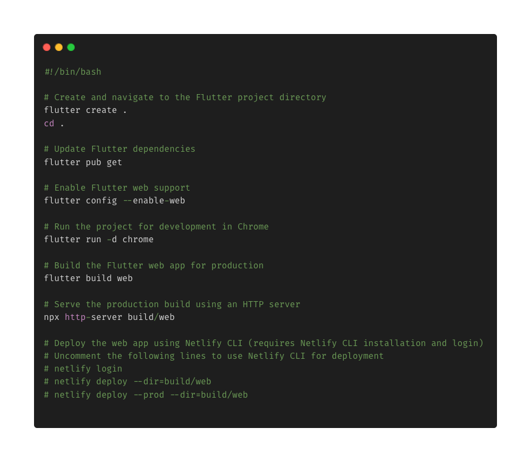

# Vision Week

[]()


[](https://github.com/Kvnbbg/Vision-Week-Virtual-Exploration/graphs/contributors)
[](https://github.com/Kvnbbg/Vision-Week-Virtual-Exploration/issues)
[](https://github.com/Kvnbbg/Vision-Week-Virtual-Exploration/network)
[](https://github.com/Kvnbbg/Vision-Week-Virtual-Exploration/stargazers)
[](https://github.com/Kvnbbg/Vision-Week-Virtual-Exploration/blob/main/LICENSE)

## Overview

**Vision Week** is an innovative web and mobile application offering a unique virtual zoo experience through VR headsets. Explore various paths with curated video content at each point of interest, available through a monthly subscription.

**Vision Week** est une application web et mobile innovante offrant une expérience de zoo virtuel unique avec des casques VR. Explorez divers chemins avec du contenu vidéo à chaque point d'intérêt, accessible via un abonnement mensuel.

## Presentation

- [Video Presentation on YouTube](#)
- [Présentation vidéo sur YouTube](#)

## About the Project

**Vision Week** ran from March 1, 2024, to July 1, 2024. It seamlessly combines virtual exploration with real-world interactions, drawing inspiration from Apple Vision Pro and Meta.

**Vision Week** s'est déroulé du 1er mars 2024 au 1er juillet 2024, combinant une exploration virtuelle avec des interactions réelles, inspiré par Apple Vision Pro et Meta.

For a detailed overview of the project's architecture, please see [ARCHITECTURE.md](ARCHITECTURE.md).

- [Onboarding with Trello](https://trello.com/invite/b/d0s3w1dC/ATTI06fd9d3a996d76b6a64f03d769128607E026F6C8/kvnbbg-vision-week-virtual-explorat)
- [Intégration avec Trello](https://trello.com/invite/b/d0s3w1dC/ATTI06fd9d3a996d76b6a64f03d769128607E026F6C8/kvnbbg-vision-week-virtual-explorat)
- [Agile Method with Scrum, Slack, Confluence, and Jira](https://join.slack.com/t/kvnbbgworkspace/shared_invite/zt-2l36m5wvl-rhrPKr0n5O9B_flmlsQbKw)
- [Méthode Agile avec Scrum, Slack, Confluence, et Jira](https://join.slack.com/t/kvnbbgworkspace/shared_invite/zt-2l36m5wvl-rhrPKr0n5O9B_flmlsQbKw)
- [Discord Group](https://discord.com/invite/wppHraKvQF)
- [Groupe Discord](https://discord.com/invite/wppHraKvQF)

## Table of Contents

- [Features](#features)
- [Technologies](#technologies)
- [Prototype](#prototype)
- [Installation](#installation)
- [Running the Backend](#running-the-backend)
- [Contributing](#contributing)
- [Future Development](#future-development)
- [Sponsor](#sponsor)
- [Acknowledgements](#acknowledgements)
- [Learn More](#learn-more)
- [Contributors](#contributors)
- [Useful Links](#useful-links)
- [Side Project for Fun](#side-project-for-fun)

## Features

- **Explore by Category**: Discover videos categorized by type of exploration.
- **Search Functionality**: Search for videos using keywords or location.
- **Detailed Information**: Learn more about each exploration.
- **Interactive Games**: Participate in engaging and educational games.
- **Latest News Updates**: Stay updated with the latest news.
- **User Data Management**: Efficiently manage user data.
- **Zoo Information**: Explore details about animals and their habitats.
- **Access Logs**: Track data access for transparency.
- **Future Interactive Experience**: User comments and ratings coming soon.
- **Multi-language Support**: Available in both French and English.
- **Dark/Light Mode**: Switch between dark and light themes based on user preference.

## Technologies

- **Frontend**: Dart (Flutter)
- **Backend**: PHP (API development)
- **Database**: MySQL

## Prototype

- [Prototype & Wireframe on Figma](https://codepen.io/Kvnbbg-the-animator/pen/VwOypXB)

## Installation



### Prerequisites

- Dart and Flutter SDK: [Installation Guide](https://flutter.dev/docs/get-started/install)
- Gradle: [Installation Guide](https://gradle.org/install/)
- MySQL: [Installation Guide](https://dev.mysql.com/doc/refman/8.0/en/installing.html)

### Steps

1. **Clone the repository**:
   ```bash
   git clone https://github.com/Kvnbbg/Vision-Week-Virtual-Exploration.git
   cd Vision-Week-Virtual-Exploration
   ```

2. **Run the Application**:
   - **Alternative**:
    ```bash
    chmod +x start_app.py
    ./start_app.py
    ```
   - **Web**: 
     ```bash
     flutter build web
     flutter run -d web
     ```
   - **Web Mobile**: 
     ```bash
     flutter run -d chrome
     ```
   - **Android/iOS (Release with Obfuscation)**:
     For enhanced security, build your release versions with obfuscation:
     ```bash
     # For Android APK
     flutter build apk --obfuscate --split-debug-info=./build/app/outputs/symbols
     # For Android App Bundle
     flutter build appbundle --obfuscate --split-debug-info=./build/app/outputs/symbols
     # For iOS
     flutter build ios --obfuscate --split-debug-info=./build/app/outputs/symbols
     ```
     (Note: Adjust `--split-debug-info` path as needed.)
   - **Desktop**:
     ```bash
     flutter build windows
     flutter build macos
     flutter build linux
     ```
     (Consider applying obfuscation to desktop builds if sensitive logic is present.)

## Running the Backend

1. **Install PHP**:
   - Download and install from [php.net](https://www.php.net/).

2. **Configure Database (MySQL)**:
   - Create a new database (e.g., `vision_week_db`) and user on your MySQL server.
   - **Import SQL Schemas**: You will need to import the table structures. SQL files are located in the `lib/database/` directory. This includes:
     - `zoo.sql` (example, if it contains main app schema)
     - `animals.sql` (example)
     - `videos.sql` (example)
     - `messaging_schema.sql` (for the new messaging features)
     - And any other relevant `.sql` files for table creation.
     (Example import command: `mysql -u youruser -p your_database_name < lib/database/your_schema_file.sql`)
   - Update the database credentials in `public/src/db_config.php` by setting the appropriate environment variables as outlined in that file.

3. **Start the HTTP API Server (Slim Application)**:
   - Navigate to the project root directory.
   - Ensure PHP is installed and accessible.
   - Start the server (which serves from the `public` directory):
     ```bash
     php -S localhost:8000 -t public
     ```
   - **API Documentation**: As API endpoints are developed in the Slim framework, they should be documented using OpenAPI (Swagger) specifications. Refer to `ARCHITECTURE.md` for more details.

### Running the WebSocket Server (for Real-time Messaging)

The real-time messaging features are handled by a separate WebSocket server.

1. **Ensure Composer Dependencies are Installed**:
   If you haven't already, install PHP dependencies:
   ```bash
   composer install
   ```

2. **Start the WebSocket Server**:
   Navigate to the project root directory and run:
   ```bash
   php server/websocket_server.php
   ```
   This will typically start the server on port 8080 (as configured in the script). Check the console output for the exact port.

   **Note**: This server needs to be running alongside the main web server (PHP Slim application) for messaging features to work.

## Testing & CI

- **Flutter Tests**: Run Flutter unit and widget tests using `flutter test`.
- **PHP Backend Tests**: PHPUnit is used for backend testing. Run tests using `composer test` (this executes `phpunit`). Ensure you have run `composer install` first.
- **Continuous Integration (CI)**: A CI pipeline is set up using GitHub Actions (see `.github/workflows/ci.yml`). It automatically runs linters and tests on pushes and pull requests to main development branches.

## Contributing

We welcome contributions to improve this project! Feel free to fork the repository and submit pull requests with your enhancements.

Refer to our [CONTRIBUTING](CONTRIBUTING.md) guide for more details.

## Future Development & MVP Focus

The goal is to deliver a compelling Minimum Viable Product (MVP) that validates the core virtual zoo experience and subscription model. Future development will be prioritized accordingly:

**Core MVP Features (Must-Haves):**
- **Robust Backend & Data Management**: Complete the PHP/Slim backend to reliably manage essential data:
    - Video content metadata (paths, descriptions, points of interest).
    - Curated exploration paths.
    - Basic zoo information (animals, habitats linked to videos).
- **Subscription Management**: Implement core subscription plans and payment gateway integration (e.g., Stripe, PayPal) to enable the monthly subscription model.
- **Core VR Experience**: Ensure the basic VR exploration with curated video content at points of interest is functional and engaging on target VR headsets.
- **User Authentication**: Solidify user authentication using Firebase Auth.

**Post-MVP Enhancements (Should/Could-Haves, for iterative development):**
- **Video Platform Integration**: Integrate with platforms like YouTube or Vimeo for more scalable video hosting and streaming, if direct hosting becomes a bottleneck.
- **User Interactions**: Enable user comments and ratings on videos or points of interest to build community. (Consider Firebase for this).
- **Enhanced VR Features**: Improve VR experiences with more interactive elements, better graphics, and smoother navigation based on user feedback.
- **Educational Resources**: Add detailed educational resources, quizzes, or guided tours related to the animals and exhibits.
- **Admin Panel**: Develop a web-based admin panel for managing content (videos, paths, zoo information, users, subscriptions).
- **Advanced Search & Filtering**: Improve search functionality with more filters (e.g., animal type, region, duration).
- **Personalization (AI-driven)**: Offer AI-driven personalized exploration paths or content recommendations based on user behavior and preferences.
- **Progressive Web App (PWA)**: Enhance the web version with PWA capabilities for an installable, app-like experience and potential offline features.

## User Documentation

To ensure a positive user experience, especially for the novel VR interactions, consider:
- **In-App Onboarding**: Clear, concise guidance within the app for first-time users, explaining navigation, controls, and key features.
- **Simple FAQ/Help Section**: A readily accessible section answering common questions or troubleshooting basic issues.

## Sponsor

Your sponsorship helps cover hosting, domain registration, and development tools.

Read more on [SPONSORING](SPONSORING.md) Vision Week.

Thank you for your support!

## Acknowledgements

This project was created by Kevin MARVILLE for STUDI. Many thanks to [STUDI](https://studi.com) for their support.

## Learn More

For more information, visit [kvnbbg.fr](https://kvnbbg.fr).

## Contributors

[](https://github.com/Kvnbbg/Vision-Week-Virtual-Exploration/graphs/contributors)

We appreciate all contributors who have helped improve this project.

## Running Backend Services with Docker (Recommended for Development)

For a consistent development environment, you can use Docker and Docker Compose to run the backend services (Slim API, WebSocket Server, MySQL Database).

### Prerequisites
- Docker: [Install Docker](https://docs.docker.com/get-docker/)
- Docker Compose: [Install Docker Compose](https://docs.docker.com/compose/install/) (Often included with Docker Desktop)

### Steps
1.  **Navigate to the project root directory** (where `docker-compose.yml` is located).
2.  **Build and start the services**:
    ```bash
    docker-compose up --build
    ```
    - The `--build` flag ensures images are built if they don't exist or if Dockerfiles have changed.
    - To run in detached mode (in the background), use `docker-compose up -d --build`.
3.  **Accessing services**:
    -   **Slim API**: `http://localhost:8000`
    -   **WebSocket Server**: `ws://localhost:8080`
    -   **MySQL Database**: Connect using a MySQL client to `localhost:3306` (credentials are in `docker-compose.yml` and used by the PHP services via environment variables).
4.  **Stopping the services**:
    ```bash
    docker-compose down
    ```
    - To stop and remove volumes (like `mysql_data`): `docker-compose down -v`

**Note on Database Initialization**:
The `docker-compose.yml` for `mysql_db` can be configured to automatically import `.sql`, `.sql.gz`, or `.sh` scripts placed in a directory mounted to `/docker-entrypoint-initdb.d` in the MySQL container. You might want to copy your schema files (e.g., from `lib/database/`) into a dedicated `docker-init-db/` folder in your project root and then add this volume mount to the `mysql_db` service in `docker-compose.yml`:
```yaml
# In docker-compose.yml, under services.mysql_db.volumes:
# - ./docker-init-db:/docker-entrypoint-initdb.d
```
This will ensure your database schema is created when the MySQL container starts for the first time.

## Author / Credits

This project is developed and maintained by **Kevin Marville**.

-   **Website**: [kvnbbg.fr](https://kvnbbg.fr)
-   **Instagram**: [@techandstream](https://instagram.com/techandstream)

## Useful Links

- [Discussion](https://github.com/Kvnbbg/Vision-Week-Virtual-Exploration/discussions)
- [Insight](https://github.com/Kvnbbg/Vision-Week-Virtual-Exploration/settings/access)

## Side Project for Fun

Check out my side project, TurboZoo:
- [GitHub](https://github.com/Kvnbbg/TurboZoo)
- [Replit](https://replit.com/@kvnbbg/TurboZoo)
- [First Version Video](https://www.youtube.com/watch?v=iS9uFwMw1SM)

## Deployment Strategy

A robust deployment strategy is key for delivering updates efficiently and maintaining stability. Consider the following:

**Current Considerations (as per project setup):**
- The Flutter web application can be deployed as static files to services like Netlify or Vercel.
- The PHP/Slim backend API will need a hosting environment that supports PHP (e.g., traditional web hosts, VPS, or container platforms like Docker via Back4App, AWS Elastic Beanstalk, Google Cloud Run).

**Recommendations:**
- **CI/CD Pipeline:** Implement a Continuous Integration/Continuous Deployment (CI/CD) pipeline (e.g., using GitHub Actions, GitLab CI/CD, Jenkins) to automate testing, building, and deployment for both the Flutter app and the PHP backend.
- **Environment Configuration:** Manage environment-specific configurations (e.g., database credentials, API keys) securely, typically using environment variables (as implemented for `db_config.php`). Do not commit sensitive configuration directly to the repository.
- **Semantic Versioning:** Adopt semantic versioning (e.g., `MAJOR.MINOR.PATCH`) for releases to clearly communicate the nature of changes.
- **Staged Rollouts (Mobile):** For mobile app updates (iOS/Android), utilize the staged rollout features provided by the Apple App Store and Google Play Store to gradually release new versions to users, monitoring for issues before a full rollout.
- **Database Migrations (Backend):** Implement a strategy for managing database schema changes (migrations) as the backend evolves. Tools like Phinx or Doctrine Migrations can be used with PHP.
- **Monitoring & Rollback:** Ensure adequate monitoring is in place post-deployment (leveraging observability tools). Have a plan for quick rollbacks to a previous stable version if critical issues arise.

**Note on Current Deployment Section in README:**
The current "Deployment" section mentions Netlify (good for Flutter web) and Back4App (for Docker containers - could host the PHP backend). The "Alternative Deployment Options" for Vercel also suits Flutter web. This strategy should be expanded with CI/CD and other best practices mentioned above. The reference to "Node.js application" for Back4App/Vercel should be updated if the primary backend is PHP.
