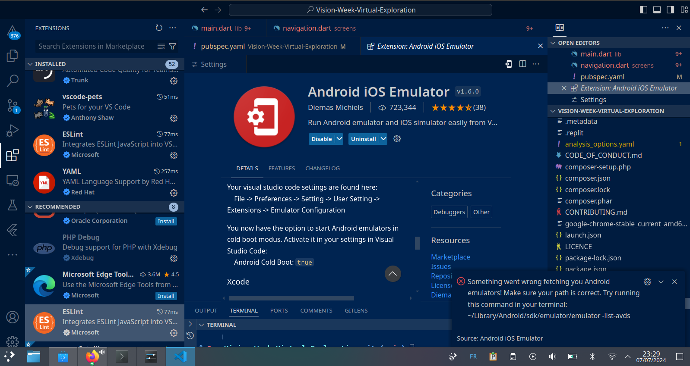

Sure! Here is an updated and improved version of your `README.md`, including emojis for languages, clearer instructions, and more concise explanations:

---

# Vision Week

[Play Live 🚀](https://vision-week-783f01d43fbd.herokuapp.com/)


[](https://github.com/Kvnbbg/Vision-Week-Virtual-Exploration/graphs/contributors)
[](https://github.com/Kvnbbg/Vision-Week-Virtual-Exploration/issues)
[](https://github.com/Kvnbbg/Vision-Week-Virtual-Exploration/network)
[](https://github.com/Kvnbbg/Vision-Week-Virtual-Exploration/stargazers)
[](https://github.com/Kvnbbg/Vision-Week-Virtual-Exploration/blob/main/LICENSE)

**Vision Week** is a web and mobile application offering a unique virtual zoo experience with VR headsets. Explore various paths with video content at each point of interest, accessible through a monthly subscription.

**Vision Week** est une application web et mobile offrant une expérience de zoo virtuel unique avec des casques VR. Explorez divers chemins avec du contenu vidéo à chaque point d'intérêt, accessible par un abonnement mensuel.

## Presentation

- [Video Presentation on YouTube](#)
- [Présentation vidéo sur YouTube](#)

## About

**Vision Week** is an innovative project that ran from March 1, 2024, to July 1, 2024. It combines virtual exploration with real interactions, inspired by Apple Vision Pro and Meta.

**Vision Week** est un projet innovant qui s'est déroulé du 1er mars 2024 au 1er juillet 2024. Il combine exploration virtuelle et interactions réelles, inspiré par Apple Vision Pro et Meta.

- [Onboarding with Trello](https://trello.com/invite/b/d0s3w1dC/ATTI06fd9d3a996d76b6a64f03d769128607E026F6C8/kvnbbg-vision-week-virtual-explorat)
- [Intégration avec Trello](https://trello.com/invite/b/d0s3w1dC/ATTI06fd9d3a996d76b6a64f03d769128607E026F6C8/kvnbbg-vision-week-virtual-explorat)
- [Agile Method with Scrum, Slack, Confluence, and Jira](https://join.slack.com/t/kvnbbgworkspace/shared_invite/zt-2l36m5wvl-rhrPKr0n5O9B_flmlsQbKw)
- [Méthode Agile avec Scrum, Slack, Confluence, et Jira](https://join.slack.com/t/kvnbbgworkspace/shared_invite/zt-2l36m5wvl-rhrPKr0n5O9B_flmlsQbKw)
- [Discord Group](https://discord.com/invite/wppHraKvQF)
- [Groupe Discord](https://discord.com/invite/wppHraKvQF)

## Table of Contents / Table des Matières

- [Features / Fonctionnalités](#features)
- [Technologies](#technologies)
- [Prototype](#prototype)
- [Installation](#installation)
- [Running the Backend / Exécution du Backend](#running-the-backend)
- [Contributing / Contribuer](#contributing)
- [Future Development / Développement Futur](#future-development)
- [Sponsor](#sponsor)
- [Acknowledgements / Remerciements](#acknowledgements)
- [Learn More / En Savoir Plus](#learn-more)
- [Contributors / Contributeurs](#contributors)
- [Useful Links / Liens Utiles](#useful-links)
- [Side Project for Fun / Projet Annexe pour le Plaisir](#side-project-for-fun)

## Features / Fonctionnalités

- **Explore by Category / Explorer par Catégorie**: Discover videos by type of exploration.
- **Search Functionality / Fonction de Recherche**: Search for videos by keywords or location.
- **Detailed Information / Informations Détailées**: Learn more about each exploration.
- **Interactive Games / Jeux Interactifs**: Participate in fun and educational games.
- **Latest News Updates / Dernières Mises à Jour**: Stay informed with the latest news.
- **User Data Management / Gestion des Données Utilisateurs**: Efficiently manage user data.
- **Zoo Information / Informations sur le Zoo**: Explore animals and their habitats.
- **Access Logs / Journaux d'Accès**: Track data access for transparency.
- **Future Interactive Experience / Expérience Interactive Future**: User comments and ratings coming soon.
- **Multi-language Support / Support Multilingue**: Available in both French and English.
- **Dark/Light Mode / Mode Sombre/Clair**: Switch between dark and light themes based on user preference.

## Technologies

- **Frontend**: Dart (Flutter)
- **Backend**: PHP (API development)
- **Database**: MySQL

## Prototype

- [Prototype & Wireframe on Figma](https://codepen.io/Kvnbbg-the-animator/pen/VwOypXB)
- [Prototype & Wireframe sur Figma](https://codepen.io/Kvnbbg-the-animator/pen/VwOypXB)

## Installation


### Running the Extensions / Exécution des Extensions



This extension is available on [the Visual Studio Marketplace](https://marketplace.visualstudio.com/items?itemName=DiemasMichiels.emulate/)

Cette extension est disponible sur [le Marketplace Visual Studio](https://marketplace.visualstudio.com/items?itemName=DiemasMichiels.emulate/)

### Prerequisites / Prérequis

- Dart and Flutter SDK: [Installation Guide](https://flutter.dev/docs/get-started/install)
- Gradle: [Installation Guide](https://gradle.org/install/)
- MySQL: [Installation Guide](https://dev.mysql.com/doc/refman/8.0/en/installing.html)

- Dart et Flutter SDK : [Guide d'Installation](https://flutter.dev/docs/get-started/install)
- Gradle : [Guide d'Installation](https://gradle.org/install/)
- MySQL : [Guide d'Installation](https://dev.mysql.com/doc/refman/8.0/en/installing.html)

### Steps / Étapes

1. **Clone the repository / Cloner le dépôt**:
   ```bash
   git clone https://github.com/Kvnbbg/Vision-Week-Virtual-Exploration.git
   cd Vision-Week-Virtual-Exploration
   ```

2. **Run the Application / Exécuter l'Application**:
   - **Web**: 
     ```bash
     flutter build web
     flutter run -d web
     ```
   - **Web Mobile**: 
     ```bash
     flutter run -d chrome
     ```
   - **Android/iOS**: 
     ```bash
     flutter build apk
     flutter build ios
     ```
   - **Desktop**:
     ```bash
     flutter build windows
     flutter build macos
     flutter build linux
     ```

## Running the Backend / Exécution du Backend

1. **Install PHP / Installer PHP**:
   - Download and install from [php.net](https://www.php.net/).
   - Télécharger et installer depuis [php.net](https://www.php.net/).

2. **Configure Database / Configurer la Base de Données**:
   - Create a new database and user on your MySQL server.
   - Créez une nouvelle base de données et un utilisateur sur votre serveur MySQL.
   - Update the credentials in `backend/db_config.php`.
   - Mettez à jour les informations d'identification dans `backend/db_config.php`.

3. **Start the Server / Démarrer le Serveur**:
   - Navigate to the `backend` directory.
   - Naviguez jusqu'au répertoire `backend`.
   - Start the server with:
     ```bash
     php -S localhost:8000
     ```
   - Démarrez le serveur avec :
     ```bash
     php -S localhost:8000
     ```

## Contributing / Contribuer

We welcome contributions to improve this project! Feel free to fork the repository and submit pull requests with your enhancements.

Nous accueillons les contributions pour améliorer ce projet ! N'hésitez pas à forker le dépôt et à soumettre des pull requests avec vos améliorations.

Refer to our [CONTRIBUTING](CONTRIBUTING.md) guide for more details.

Reportez-vous à notre guide [CONTRIBUTING](CONTRIBUTING.md) pour plus de détails.

## Future Development / Développement Futur

- **Video Platform Integration / Intégration de Plateforme Vidéo**: Integrate with platforms like YouTube or Vimeo.
-

 **User Interactions / Interactions Utilisateurs**: Enable user comments and ratings.
- **Educational Resources / Ressources Éducatives**: Add educational resources.
- **Backend Development / Développement du Backend**: Develop the backend for managing videos and interactions.
- **Enhanced VR Features / Amélioration des Fonctionnalités VR**: Improve VR experiences with more interactive elements.
- **Subscription Management / Gestion des Abonnements**: Implement subscription plans and payment gateways.

## Sponsor

Your sponsorship helps cover hosting, domain registration, and development tools.

Votre parrainage aide à couvrir l'hébergement, l'enregistrement de domaine et les outils de développement.

Read more on [SPONSORING](SPONSORING.md) Vision Week.

Lisez plus sur le parrainage de Vision Week sur [SPONSORING](SPONSORING.md).

Thank you for your support!

Merci pour votre soutien !

## Acknowledgements / Remerciements

This project was created by Kevin MARVILLE for STUDI. Many thanks to [STUDI](https://studi.com) for their support.

Ce projet a été créé par Kevin MARVILLE pour STUDI. Un grand merci à [STUDI](https://studi.com) pour leur soutien.

## Learn More / En Savoir Plus

For more information, visit [kvnbbg.fr](https://kvnbbg.fr).

Pour plus d'informations, visitez [kvnbbg.fr](https://kvnbbg.fr).

## Contributors / Contributeurs

[](https://github.com/Kvnbbg/Vision-Week-Virtual-Exploration/graphs/contributors)

We appreciate all contributors who have helped improve this project.

Nous remercions tous les contributeurs qui ont aidé à améliorer ce projet.

## Useful Links / Liens Utiles

- [Discussion](https://github.com/Kvnbbg/Vision-Week-Virtual-Exploration/discussions)
- [Insight](https://github.com/Kvnbbg/Vision-Week-Virtual-Exploration/settings/access)

## Side Project for Fun / Projet Annexe pour le Plaisir

Check out my side project, TurboZoo:
Découvrez mon projet annexe, TurboZoo :
- [GitHub](https://github.com/Kvnbbg/TurboZoo)
- [Replit](https://replit.com/@kvnbbg/TurboZoo)
- [First Version Video / Première Version Vidéo](https://www.youtube.com/watch?v=iS9uFwMw1SM)

---